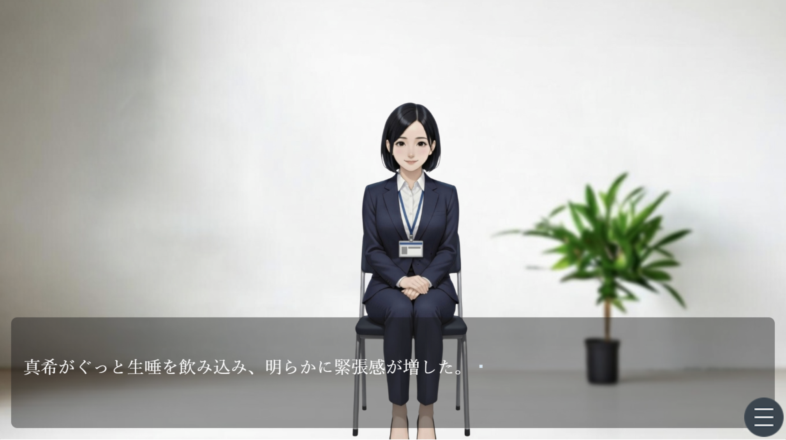

皆様初めまして。
ダウグアングジングと申します。

## ドラクエ7が面白い
最近、ダウグアングジングはSwitch2のドラゴンクエスト7に夢中になっております。
（ちなみに、DQ7はPS版とスマホ版をプレイしたことがありますが、両方途中で挫折してます...）
やっていて感じる、<strong>圧倒的な手触りの良さと没入感..！</strong>体験版を始めるまでは期待薄だったのですが、プレイしてすぐに購入を決めました。

## 没入感の秘密
あの没入感の秘密は、数えきれないほどの幾つもの要素から成り立っていると思うのですが、その一つに**フォーカス演出**があると思いました。（プレイ済みの方なら共感いただけるかも）
フィールドマップに出た時、**主人公と仲間たちの一定範囲外はボヤける**のです。
このボヤけの効果は大きく２つあると感じました！

１つ目は**集中**です。
このボヤけがないと、フィールドマップのあちこちが気になってしまうのですが、
この効果で自然と不要な情報が削ぎ落とされ、とても集中できてしまうのです！

そして、２つ目は**リアリティ**です。
普段の生活で私たちは、物を見るときには常に何かに焦点を合わせます。（人と背景が同じレベルではっきり見えることってないですよね？

## 従順審査にも取り入れてみた
この演出はあやかりたい！と思い、ダウグアングジング1作目の従順審査でも、キャラクターが椅子に座った瞬間、背景はボヤかす様にしてます。
できれば皆様に人物へ集中していただければという思いでしたが、いかがでしたでしょうか？（効果無かったなら、それはそれでまた教えてください笑）

## ダウグアングジングの好きなゲーム

手触りの良さと没入感が圧倒的な、ダウグアングジングの好きなゲームは、Inscription（インスクリプション）、Balatro（バラトロ）です。
これらのゲームについてはまた別の機会に語れたらと思っております...！
（ちなみに成人ゲームでは、サークルALLDICE様の[侵蝕のヒプノシスシリーズ](https://dlaf.jp/maniax/dlaf/=/t/s/link/work/aid/dawuguangjingcien/id/RJ01082260.html)です。）

定期的に記事を残していくので、ぜひフォロー、コメントいただけますと幸いです！
以上、ダウグアングジングでした。

